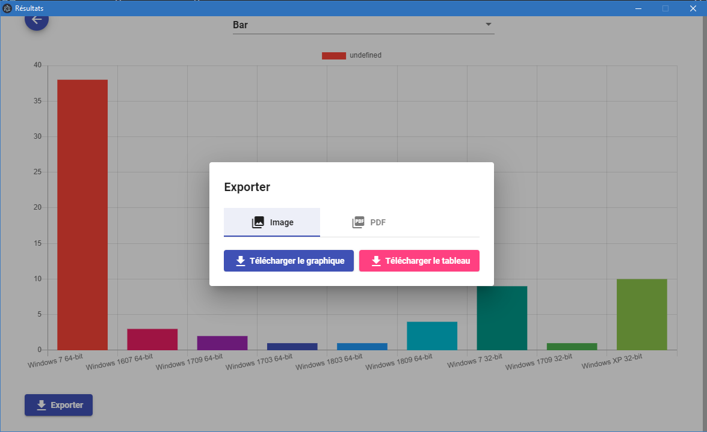

# Graph Inventory
Application bureau permettant la génération et l'export de graphique à partir de données issues de [GLPI](https://glpi-project.org/fr/).

## Installation
```
yarn install
# installation des dépendances

yarn run electron
# lancement du logiciel en mode développement

yarn run package-win
# compilation pour Windows
```

## Captures d'écran




## Licence
Dépôt sous licence [MIT](https://choosealicense.com/licenses/mit/).